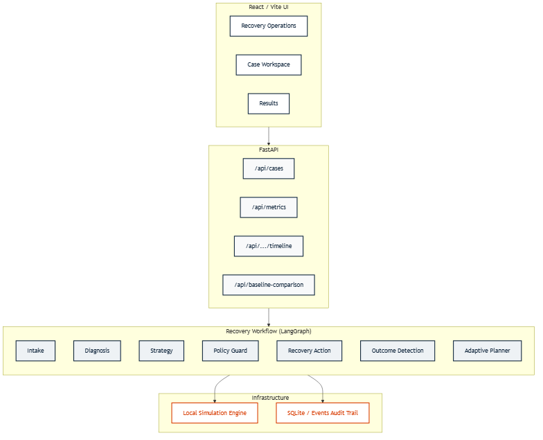
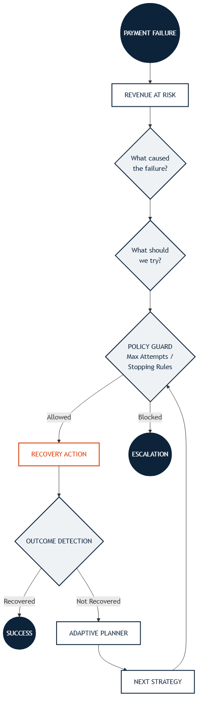

# Adaptive Payment Revenue Recovery Agent

"An adaptive agent that diagnoses failed payments, chooses bounded recovery actions, and adapts or escalates based on the outcome."

## The Problem

Payment failures have different causes and therefore should not all receive the same recovery treatment. 

A blind retry strategy can:
- Fail repeatedly on unrecoverable errors.
- Waste recovery opportunities on transient customer issues.
- Create unnecessary customer friction.
- Be inappropriate or non-compliant for permanent failures.

This system treats payment revenue recovery as a closed-loop decision process, ensuring that every intervention is context-aware and safely bounded.

## The Solution

When a payment fails, the system orchestrates a core recovery loop:

- **Detect**: Identifies the failure and calculates revenue at risk.
- **Diagnose**: Categorizes the root cause (e.g., transient technical, transient customer, permanent).
- **Decide**: Selects the optimal recovery strategy based on the diagnosis context.
- **Act**: Executes a bounded recovery action governed by strict policy rules.
- **Observe**: Detects the outcome of the action.
- **Adapt / Stop**: Dynamically changes follow-up strategies based on preceding outcomes, or escalates safely when recovery is impossible.

## Why This Fits Razorpay Track 03

This project directly implements the Track 03 objective: *"Find revenue that's slipping away and win it back."*

- **Detect revenue at risk**: Captures failed payments and aggregates the total monetary value at risk.
- **Diagnose failure**: Automatically categorizes reasons behind the failure (e.g., `bank_timeout`, `invalid_card`).
- **Determine intervention**: Strategically chooses actions like an `immediate_retry` or `notify_customer`.
- **Execute bounded recovery**: Each step is a distinct action in a simulated environment; the agent pauses to observe outcomes.
- **Observe outcome**: Monitors responses, such as a simulated customer top-up.
- **Adapt**: Modifies follow-up strategies (e.g., retrying after customer action).
- **Stop/Escalate**: Applies strict policy guards to prevent retries on permanent failures.
- **Audit**: Event-sourced timeline capturing every decision and policy check.
- **Measure recovered revenue**: Evaluated via a 40-case simulation to prove measurable ROI.

## How It Works

Three representative scenarios demonstrate the agent's behavior:

1. **`bank_timeout`**: Diagnosed as a transient technical failure → Executes immediate retry → Recovers seamlessly.
2. **`insufficient_funds`**: Diagnosed as a transient customer failure → Customer notification → Simulated customer response/top-up → Adaptive planner recognizes the signal → Retry → Recovers.
3. **`invalid_card`**: Diagnosed as a permanent failure → Policy guard blocks recovery → Clean escalation to a human operator (no blind retries attempted).

## Architecture

The system is built on a modern architecture prioritizing transparency and event-sourced auditing.



## Recovery Decision Loop



## Measured Evidence

To validate the adaptive strategy, we ran a deterministic 40-case product simulation comparing it to a naive baseline (one immediate retry).

| Metric | Naive Retry | Adaptive Recovery |
|---|---:|---:|
| Cases | 40 | 40 |
| Revenue at Risk | ₹409,754.80 | ₹409,754.80 |
| Revenue Recovered | ₹88,727.76 | ₹227,205.47 |
| Recovery Rate | 21.65% | 55.45% |

**+33.8 percentage points**

**₹138,477.71 additional simulated revenue recovered**

*(Deterministic 40-case product simulation. This is directional product-level evidence, not a statistically significant experiment.)*

## Safety and Recovery Boundaries

- **Policy Guard**: Intercepts actions to enforce business logic before execution.
- **Bounded Attempts**: Strict max limits on how many times an action can be attempted.
- **Idempotency**: Prevents duplicate recovery actions on the same state.
- **Permanent Failure Stopping**: Immediately halts unrecoverable errors (e.g., expired cards).
- **Escalation**: Routes unrecoverable cases to a human operator.
- **Audit Trail**: Every decision is logged in a centralized timeline for complete visibility.

## Runtime and Reproducibility

This prototype is engineered for absolute reproducibility and judge transparency during the buildathon:
- **Local Deterministic Simulation**: Uses Common Random Numbers (CRN) with fixed case-level seeds to ensure identical conditions for the baseline and adaptive agents.
- **Synthetic Payment Cases**: No real money movement or production payment processing is involved.
- **No External LLM/API Calls**: The runtime executes via deterministic, rule-based fallback logic. There are no latency, key management, or ChatGPT dependency bottlenecks.
- **No External Services Required**: The entire demo runs locally.

## Running Locally

### Backend

```bash
# From the project root, create a virtual environment
python -m venv .venv

# Install dependencies
.venv\Scripts\python.exe -m pip install -r requirements.txt

# Start the API
.venv\Scripts\python.exe -m uvicorn app.main:app --port 8000
```

### Frontend

```bash
# In a new terminal, start the Vite development server
cd frontend
npm install
npm run dev
```

### Tests

```bash
# Backend tests
.venv\Scripts\python.exe -m pytest tests/ -v

# Frontend tests
cd frontend
npm test
```

### Demo

The application ships with a pre-seeded deterministic database. If you wish to reset the demo state back to the original 3 representative cases, click the **"Reset demo"** button in the top right corner of the Recovery Operations dashboard.

## Demo Flow

1. **Recovery Operations**: View the live queue and "Revenue at Risk".
2. **`insufficient_funds` case**: Open the Case Workspace to see the adaptive recovery flow (Notification → Top-up → Retry).
3. **`invalid_card` case**: See the escalation path where the Policy Guard correctly blocks any further retries.
4. **Results page**: Toggle to the Results view to review the 40-case evaluation (+33.8 pp improvement).

## Limitations and Production Path

This buildathon prototype currently uses:
- Synthetic cases
- Simulated payment outcomes
- Deterministic probabilities
- Local execution

A production integration would replace these mocks:
- **Simulation** → Replaced by real Razorpay payment/subscription events (Webhooks).
- **Simulated Recovery Action** → Replaced by bounded Razorpay API retry requests or real customer communication workflows.
- **Synthetic Outcomes** → Replaced by real payment outcomes and asynchronous webhook events.
